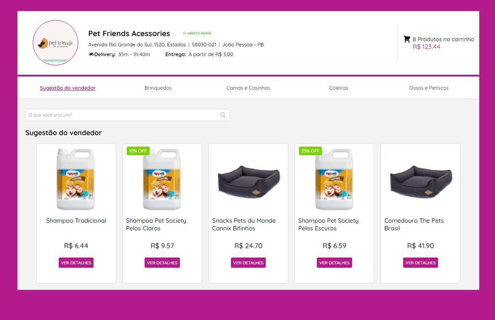
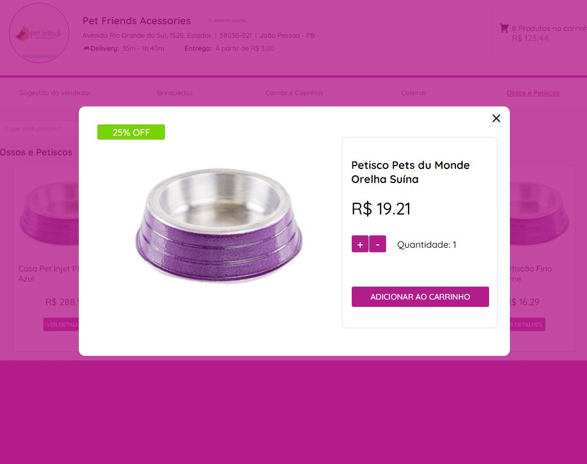

## Challenge front-end SoftCom

Para demostrar conformidade com os principais requisitos da vaga, o projeto foi implementado com ReactJs, utilizando o TypeScript dentro do framework NextJS. Utilizando ainda o JSX e o Styled Components para a construção do layout e o JSON-Server para simulação de uma API para consumo da aplicação.

Os dados para consumo com o JSON-Server estão no arquivo server.json, na raiz do projeto.

As funcionalidades dinâmicas da aplicação foram implementadas utilizando React Hooks e Context API para facilitar a comunicação e compartilhamento de estados entre os vários componentes.

Objetivando uma melhor organização dos dados e da estrutura, utilizei recursos de tipagem e interfaces disponibilizados pelo TypeScript.

- - -
### Princiais dependências

- Framework NextJS
- React Icons
- Styled Components
- TypeScript
- JSON Server

- - -
### Intalação e acesso aos recursos
+ Instalar dependências do projeto
    - yarn install
+ Iniciar o JSON-Server - [http://localhost:3333](http://localhost:3000)
    - yarn server
        - Principais end-points
            -   http://localhost:3333/profile-info
            -   http://localhost:3333/products
+ Inicar o localhost do projeto para desenvolvimento - [http://localhost:3000](http://localhost:3000)
    - yarn dev

- - -

[Link do Figma para o Layout de referencia](https://www.figma.com/file/ebcFb6dxwj4JkN7vENzgeQ/Desafio-UX?node-id=3585%3A0)

- - -

### Tela incial da aplicação implementada no desafio

### Tela do modal de exibição de detalhes
