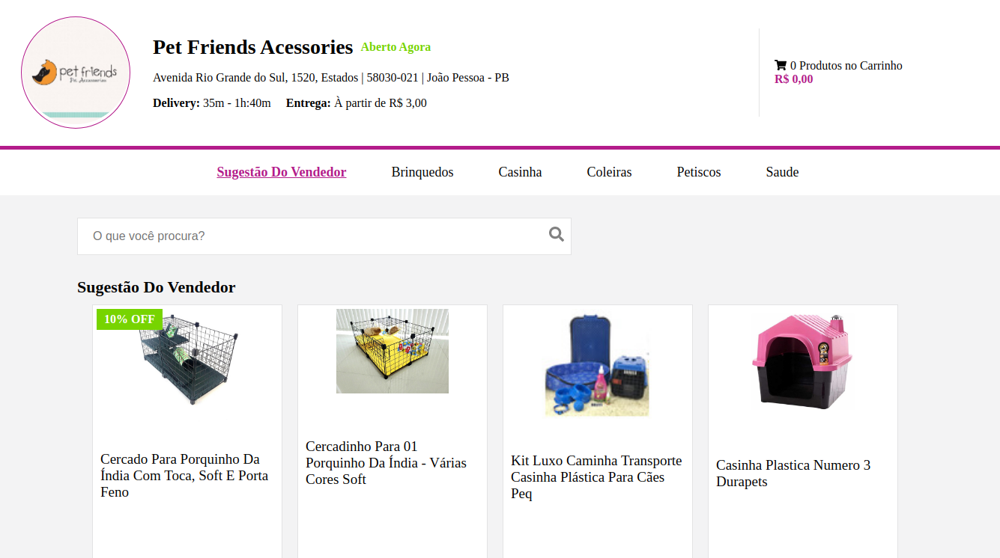
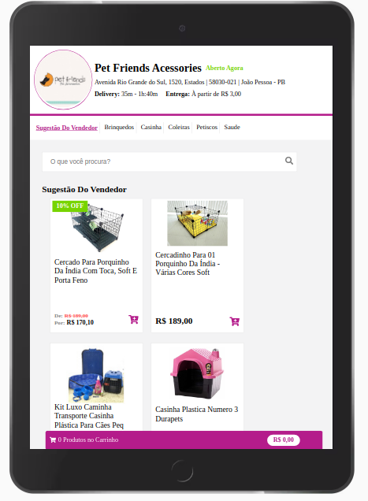

# Teste Softcom Challenge - Front-end com React - "Lojinha" Ecommerce

## Imagens do resultado

## Descrição do Projeto

Realizei um teste técnico para criar uma loja online em react clonando a UI/Design do [Figma](https://www.figma.com/file/ebcFb6dxwj4JkN7vENzgeQ/Desafio-UX?node-id=3579%3A312), Utilizei as tecnologias:

 - [x] create-react-app
 - [x] React Hooks
 - [x] Context API
 - [X] Json-Server
 - [x] HTML5 e CSS3
 - [x] React Testing Libery

# Clone este repositório
$ `git clone git@github.com:rafasysop/lojinha-pet.git`
ou acesse <https://github.com/rafasysop/lojinha-pet/archive/refs/heads/main.zip> e baixe o arquivo zip.

# Acesse a pasta do projeto no terminal/cmd
$ `cd lojinha-pet`

# Instale as dependências
$ `npm install`

# Execute o Json-Server - O servidor inciará na porta:3004
$ `npm run api`

# Execute a aplicação em modo de desenvolvimento
$ `npm run start`

# Execute os testes da aplicação
$ `npm run test`

# O servidor inciará na porta:3000 - acesse <http://localhost:3000>
